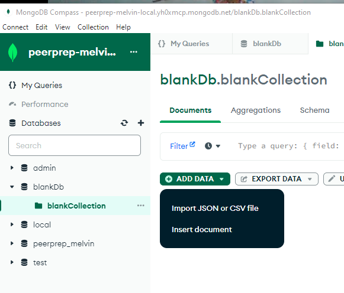

## Setting-up

1. Set up a MongoDB Shared Cluster by following the steps in this [Guide](./MongoDBSetup.md).

2. After setting up, go to the Database Deployment Page. You would see a list of the Databases you have set up. Select `Connect` on the cluster you just created earlier on for Question Service.


3. Select the `Drivers` option, as we have to link to a Node.js App (Question Service)


4. Select `Node.js` in the `Driver` pull-down menu, and copy the connection string.

Notice, you may see `<password>` in this connection string. We will be replacing this with the admin account password that we created earlier on when setting up the Shared Cluster.


5. Rename the `.env.sample` file to `.env` in the `question-service` directory.

6. Update the `DB_CLOUD_URI` of the `.env` file, and paste the string we copied earlier in step 4. Also remember to replace the `<password>` placeholder with the actual password.

```
DB_CLOUD_URI=<CONNECTION_STRING>
DB_LOCAL_URI=mongodb://localhost/${KEY_IN_YOUR_DB_HERE}
PORT=3002
ENV=PROD
JWT_SECRET=you-can-replace-this-with-your-own-secret
```


## Running Question Service

1. Open Command Line/Terminal and navigate into the `question-service` directory.

2. Run the command: `npm install`. This will install all the necessary dependencies.

3. Run the command `npm start` to start the Question Service.

## Uploading Sample Questions CSV to MongoDB

### Using MongoDBCompass

1. Set Up Your MongoDB Cloud [Guide](./MongoDBSetup.md)

2. On MongoDBCompass, Add and connect a new connection (The URI should be the cluster you've created "mongodb+srv:...")
Make sure your username and password is entered correctly.


3. Create a new database + collection


4. Access your new collection, click "Add Data" and then "Import JSON or CSV file"



5. Select the CSV sample questions file


6. Check fields and press "import"


## Question Service API Guide

### Create Question

- This endpoint adds a single question into the database.

- HTTP Method: `POST`

- Endpoint: http://localhost:3002//api/question/create

- Body: Required: title (string), description (string), category (string), complexity (['Easy', 'Medium', 'Hard'])

```json
{
  "title": "SampleTitleName",
  "description": "This is the sample question's description and an example",
  "category": ["SampleCategoryName", "SampleCategoryName2" ...],
  "complexity": "Easy",
  "testCase": [
    {
        "input": [1, 2, 3],
        "result": [3, 2, 1]
    },
    {
        "input": [4, 5, 6],
        "result": [7, 8, 9]
    }
  ]
}
```

- <a name="auth-header">Headers:</a> Required: `Authorization: Bearer <JWT_ACCESS_TOKEN>`

  - Explanation: This endpoint requires the client to include a JWT (JSON Web Token) in the HTTP request header for authentication and authorization. This token is generated during the authentication process (i.e., login) and contains information about the user's identity and permissions. The server verifies this token to ensure that the client is authorized to access the user's data.

  - Auth Rules:

    - Admin users: Can retrieve any user's data. The server verifies the user associated with the JWT token is an admin user and allows access to the requested user's data.

    - Non-admin users: Can only retrieve their own data. The server checks if the email in the request body matches the email of the user associated with the JWT token. If it matches, the server returns the user's own data.


- Responses:

| Response Code               | Result                                                   |
| --------------------------- | -------------------------------------------------------- |
| 201 (Created)               | Question Added Successfully                              |
| 400 (Bad Request)           | Missing Fields                                           |
| 401 (Unauthorized)          | Access Denied Due to Missing/Invalid/Expired JWT         |
| 403 (Forbidden)             | Access Denied for Non-admin Users Accessing Others' Data |
| 409 (Conflict)              | Duplicate Question Encountered                           |
| 500 (Internal Server Error) | Database or Server Error                                 |

### Get Question By ID

- This endpoint allows one to retrieve question data for a given Question ID.

- HTTP Method: `GET`

- Endpoint: http://localhost:3002/api/question/:id

- Body: Required: id (number)

```json
{
  "id": (unique qns identifier, positive integer)
}
```
- Responses:

| Response Code               | Result                                                   |
| --------------------------- | -------------------------------------------------------- |
| 200 (OK)                    | User Data Obtained                                       |
| 400 (Bad Request)           | Missing ID in request body                               |
| 404 (Not Found)             | No Question Found With Given ID                          |
| 500 (Internal Server Error) | Database or Server Error                                 |

### Get All Questions

- This endpoint allows one to retrieve the data of all the users from the database.

- HTTP Method: `GET`

- Endpoint: http://localhost:3002/api/question/all

- Body: Not Required

- Headers: Required: `Authorization: Bearer <JWT_ACCESS_TOKEN>`

  - Refer to the [Authorization header section in the Get User endpoint](#auth-header) for an explanation.

  - Auth Rules:

    - Admin users: Can retrieve all users' data. The server verifies the user associated with the JWT token is an admin user and allows access to all users' data.

    - Non-admin users: Not allowed access.

- Responses:

| Response Code      | Result                                           |
| ------------------ | ------------------------------------------------ |
| 200 (OK)           | All Questions Data Obtained                      |
| 400 (Bad Request)  | Database or Server Error                         |
| 401 (Unauthorized) | Access Denied Due to Missing/Invalid/Expired JWT |
| 403 (Forbidden)    | Access Denied for Non-admin Users                |
| 404 (Not Found)    | No Question In Database                          |

### Delete Question

- This endpoint allows one to delete a user and their related data in the database via user's email.

- HTTP Method: `DELETE`

3002
- Body: Required: id (number)

```json
{
  "id": (unique qns identifier, positive integer)
}
```

- Headers: Required: `Authorization: Bearer <JWT_ACCESS_TOKEN>`

  - Refer to the [Authorization header section in the Get User endpoint](#auth-header) for an explanation.

  - Auth Rules:

    - Admin users: Can delete any user's data. The server verifies the user associated with the JWT token is an admin user and allows the deletion of requested user's data.

    - Non-admin users: Can only delete their own data. The server checks if the email in the request body matches the email of the user associated with the JWT token. If it matches, the server deletes the user's own data.

- Responses:

| Response Code               | Result                                                  |
| --------------------------- | ------------------------------------------------------- |
| 200 (OK)                    | Question Deleted Successfully                           |
| 400 (Bad Request)           | Missing ID in request body                              |
| 401 (Unauthorized)          | Access Denied Due to Missing/Invalid/Expired JWT        |
| 403 (Forbidden)             | Access Denied for Non-admin Users Deleting Question     |
| 404 (Not Found)             | No Question Found With Given ID                         |
| 500 (Internal Server Error) | Database or Server Error                                |

### Update User

- This endpoint allows one to update user and their related data in the database via user's id.

- HTTP Method: `PATCH`

- Endpoint: http://localhost:3002/api/question/:id

- Body: Required: title (string), description (string), category (string), complexity (['Easy', 'Medium', 'Hard'])

```json
{
  "title": "SampleTitleName",
  "description": "This is the sample question's description and an example",
  "category": ["SampleCategoryName", "SampleCategoryName2" ...],
  "complexity": "Easy",
  "testCase": [
    {
        "input": [1, 2, 3],
        "result": [3, 2, 1]
    },
    {
        "input": [4, 5, 6],
        "result": [7, 8, 9]
    }
  ]
}
```

- Headers: Required: `Authorization: Bearer <JWT_ACCESS_TOKEN>`

  - Refer to the [Authorization header section in the Get User endpoint](#auth-header) for an explanation.

  - Auth Rules:

    - Admin users: Can update any user's data. The server verifies the user associated with the JWT token is an admin user and allows the update of requested user's data.

    - Non-admin users: Can only update their own data. The server checks if the id in the request body matches the id of the user associated with the JWT token. If it matches, the server updates the user's own data.

- Responses:

| Response Code               | Result                                                  |
| --------------------------- | ------------------------------------------------------- |
| 200 (OK)                    | Question Updated Successfully                           |
| 304 (Not Modified)          | Question is not modified                                |
| 400 (Bad Request)           | Missing ID in request body                              |
| 401 (Unauthorized)          | Access Denied Due to Missing/Invalid/Expired JWT        |
| 403 (Forbidden)             | Access Denied for Non-admin Users Editing Question      |
| 404 (Not Found)             | No Question Found With Given ID                         |
| 409 (Conflict)              | Duplicate Data Encountered                              |
| 500 (Internal Server Error) | Database or Server Error                                |


